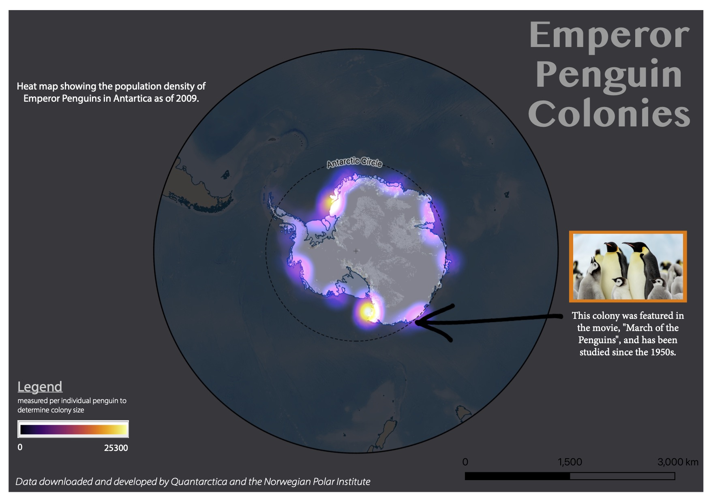

# Emperor Penguin Colonies 

Heat map of Emperor Penguin colonies in Antarctica.

Made with QGIS and Adobe Illustrator.

[Link to PDF download](heat-map.pdf)

*Data downloaded from Quantarctica*

* [Click Here](https://www.npolar.no/en/quantarctica/#toggle-id-1) to visit their website.

# More about the Colonies and Data mapped:

*Researched and collected by the Norwegian Polar Institute, Quantarctica is a collection of "geographical datasets for research, education, operations, and management in Antarctica, and let you explore, import, visualize, and share Antarctic data. It includes community-contributed, peer-reviewed data from ten different scientific themes and a professionally-designed basemap."* [Quantartica](https://www.npolar.no/en/quantarctica/#toggle-id-6)

Some of the data mapped includes the worlds southern most colony of emperor penguins in the world. Also mapped is the world's largest and smallest emperor penguin colonies.

Another colony discovered for the first time in 2009 contains 5% of the global population of emperor penguins!

